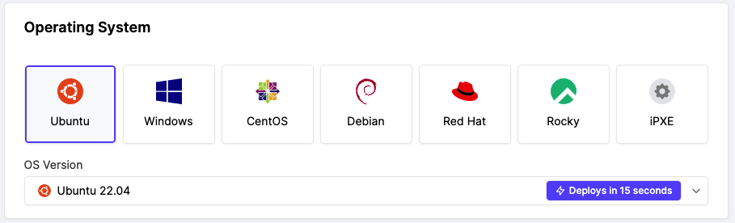
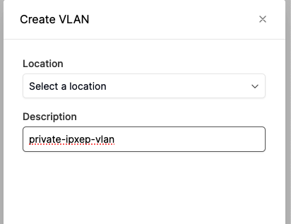
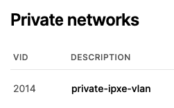
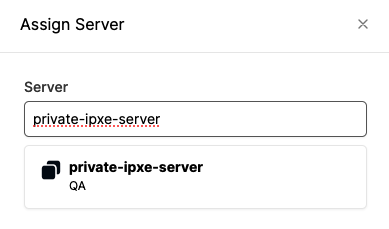
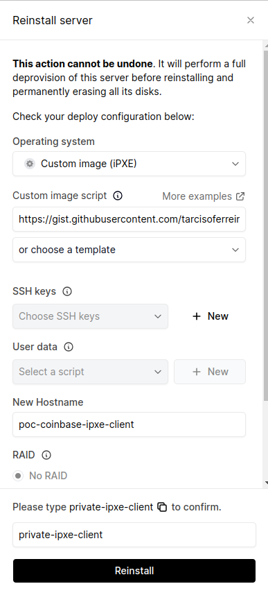

# iPXE with Private VLAN

This example shows how to use a private network to boot iPXE images.

We need to keep in mind that iPXE boot is almost completely out of automation control, once the server is configured to boot over an iPXE image, the success of the Operating System installation will depend on the set of configurations contained on the iPXE script, and also the iPXE scrip will depends on the Operating System wanted.

In this case, we are talking about Ubuntu 22.04, since Ubuntu 20, canonical removed the network boot from installation media options, making it a little bit harder to make an Ubuntu installation over the network.

What we are going to do is use NFS to serve Ubuntu Installation ISO files during iPXE boot, we have a particular constraint at the platform, each server has two network interfaces, one for Public IP that has internet access and another for the platform automation procedures, neither of them can host a DHCP-server, due to that the iPXE script must be based on static IP configurations.

### Guideline iPXE Image Server:

- Deploy of a metal as Ubuntu instant
- Create a private VLAN
- Assign the server to a private VLAN
- Configure VLAN on the OS
- Install NSF and HTTP server packages
- Download Ubuntu 22.04 installer ISO
- Mount ISO to a directory
- Configure NFS to server the directory with Ubuntu installer files
- Create a user-data file with the install configuration to be served by the HTTP server

### Deploy of a metal as Ubuntu instant

Create a server choosing the following options, you can customize as you want:


Choose a server size:


Choose a location, since the private VLAN is valid for the same site, all machines should be in the same location.


Choose a Ubuntu instant deploy option:



Choose a hostname and deploy the new server.


### Create a private vlan

On the Networking section choose Private Networks and Crate VLAN.


Choose the same location of your server and describe VLAN.



**Assign the server to a private VLAN**

Open the newly created VLAN and Assign the server created before 





### Configure VLAN on the OS

Add the VLAN config at netplan config file `/etc/netplan/50-cloud-init.yaml`, note that some parameters (vlan interface name, private subnet and vid) may be different,  vlan interface name and private subnet you can choose as you want, but the vid must be the same showed on the page of private vlan. 

```bash
vlans:
      vlan2014:
        id: 2014
        link: eno2
        addresses: [ "10.0.0.1/24" ]
```

Apply the config with the command: `netplan apply`.

### Install NSF and HTTP server packages

```bash
apt install nfs-kernel-server apache2
```

### Download Ubuntu 22.04 install ISO

```bash
wget https://releases.ubuntu.com/22.04.3/ubuntu-22.04.3-live-server-amd64.iso
```

### Mount ISO to a directory

```bash
mkdir /ubuntu22
mount ./ubuntu-22.04.3-live-server-amd64.iso /ubuntu22/
```

### Configure NFS to server the directory with Ubuntu installer files

Add the folowing line at `/etc/exports`

```bash
/ubuntu22 	*(ro,sync,no_wdelay,insecure_locks,no_root_squash,insecure,no_subtree_check)
```

Apply the config with the command: `exportfs -a`

### Create a user-data file with the install configuration to be server by HTTP server

You can create a user-data config file to automate your installation. Below is an example:

```bash
#cloud-config
autoinstall:
  version: 1
  identity:
    hostname: private-ipxe-client
    username: ubuntu
    password: $ENCRYPTED_PASSWORD 
  ssh:
    install-server: yes
    authorized-keys:
      - $SSH_KEY
    allow-pw: true
  network:
    network:
      version: 2
      ethernets:
        enp1s0f0:
          dhcp4: no
          addresses: [$PUBLIC_IP]
          gateway4: $PUBLIC_GATEWAY
          nameservers:
            addresses: [8.8.8.8, 8.8.4.4]
  storage:
    layout:
      name: direct
    config:
      - {ptable: msdos, path: /dev/sda, preserve: false, name: '', grub_device: true, type: disk, id: disk-sda}
      - {device: disk-sda, size: 1G, format: ext4, type: partition, id: partition-sda1}
      - {device: disk-sda, size: 1G, format: swap, type: partition, id: partition-sda2}
      - {device: disk-sda, size: -1, format: ext4, type: partition, id: partition-sda3}
      - {fstype: ext4, volume: partition-sda1, preserve: false, type: format, id: format-0}
      - {fstype: swap, volume: partition-sda2, preserve: false, type: format, id: format-1}
      - {fstype: ext4, volume: partition-sda3, preserve: false, type: format, id: format-2}
      - {device: format-0, path: /, type: mount, id: mount-1}
      - {device: format-2, path: /home, type: mount, id: mount-2}
  packages:
    - curl
    - vim
```
Put this file in 

```bash 
/var/www/html/ 
```
At boot time, the Ubuntu installer will request the contents of the user-data file.

### Guideline iPXE Client:

- Deploy of a metal as Ubuntu instant
- Assign the server to a private VLAN
- Reinstall the server in iPXE mode

The first two steps have already been described previously.

### Reinstall the server in iPXE mode

bellow is a sample of the iPXE script that can be used, note that the script creates a VLAN on the interface net1 and assigns a private IP,  this IP depends on the configuration applied on VLAN configuration step. 

The script uses NFS to get the kernel and image files and an argument to user-data that contains all installation definitions (this user-data is optional).

```bash
#!ipxe

vcreate --tag 2014 net1
set net1-2014/ip 10.0.0.2
set net1-2014/netmask 255.255.255.0
ifopen net1-2014

set nfs_server 10.0.0.1 # MY_NFS_ADDRESS should be replaced with a public IP from an nfs server that provides the available installation files.
set nfs_path /ubuntu22 # MY_NFS_PATH should be replaced with the directory path containing the installation files.

kernel nfs://${nfs_server}:${nfs_path}/casper/vmlinuz || read void
initrd nfs://${nfs_server}:${nfs_path}/casper/initrd || read void
imgargs vmlinuz initrd=initrd autoinstall boot=casper maybe-ubiquity console=ttyS1,115200n8 netboot=nfs nfsroot=${nfs_server}:${nfs_path} net.ifnames=0 vlan=eth1.2014:eth1 ip=10.0.0.2:::255.255.255.0::eth1.2014:off ds=nocloud;s=http://10.0.0.1/ || read void
boot || read void
```

This script should be publicly available over the internet, you can proceed with reinstall in iPXE mode.

In the newly created and VLAN-assigned server, go to actions and then the Reinstall option.


Choose the Custom Image (iPXE) option and insert the iPXE script link.



Choose reinstall option.