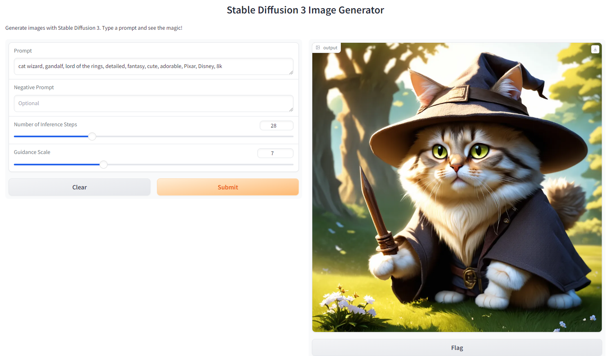

# Docker image for Stable Diffusion 3 Medium Gradio

  

## Tags
| Tag    | Description              | Size      |
| ------ | ------------------------ | --------- |
| latest | python 3.10, sd 3 medium | ~ 21.7 GB |

## Ports

| Connect Port | Internal Port | Description |
| ------------ | ------------- | ----------- |
| 8912         | 8912          | SD 3 Webui  |
| 8888         | 8888          | Jupyter Lab  |

## Environment Variables

Each of the following environment variable is optional, set either `PUBLIC_KEY` for ssh access

| Variable     | Description                             |
| ------------ | --------------------------------------- |
| PUBLIC_KEY   | Public Key for ssh access               |
| SSH_USER     | Username for ssh access (default: root) |

## Credits

This blueprint was developed by our partner researcher **Yuvraj Seegolam**:
- [Github](https://github.com/yuvraj108c)

Original Repository
- [Stable Diffusion 3 Medium Repository](https://github.com/yuvraj108c/stable-diffusion-3-medium-docker)